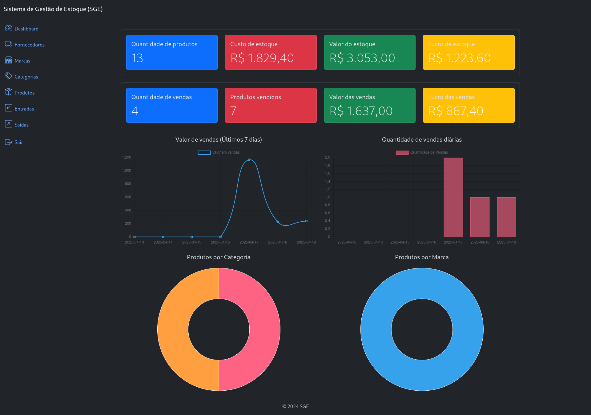

# Sistema de Gerenciamento de Estoque - SGE

## 📘 Sobre

Aplicação FullStack desenvolvida usando Djanto e Djanto REST framework para fazer o gerenciamento de estoque.

A aplicação possui uma interface web para manipulação de informações, bem como uma API RESTful.



## 💻️ Tecnologias

- Python
- Django
- Django REST framework
- SQLite

## ✅ Funcionalidade

- [x] Autenticação com JWT para proteger os endpoints da API.
- [x] Listagem, criação, atualização e deleção de produtos.
- [x] Listagem, criação, atualização e deleção de marcas de produtos.
- [x] Listagem, criação, atualização e deleção de categorias de produtos.
- [x] Listagem, criação, atualização e deleção de fornecedores de produtos.
- [x] Listagem, criação, atualização e deleção de entradas e saídas de produtos.

## ⚙️ Como usar

Para executar essa aplicação siga os seguintes passos:

1. Clone o repositório

```bash
git clone https://github.com/elainefs/django-sge.git

cd django-sge
```

2. Crie e ative um ambiente virtual

```bash
python3 -m venv .venv # Para Windows use: python -m venv .venv
source .venv/bin/activate  # Para Windows use: .venv\Scripts\activate
```

3. Instale as dependências do projeto

```bash
pip install -r requirements.txt
```

4. Crie um arquivo `.env` na raiz do projeto

O arquivo `.env-example` é um modelo de como o seu arquivo `.env` deve ser.

Para gerar uma nova `SECRET_KEY`, a partir da raiz do projeto, use o seguinte comando no terminal:

```bash
python -c "from django.core.management.utils import get_random_secret_key; print(get_random_secret_key())"
```

Edite as demais informações conforme suas preferências.

5. Execute as migrações no banco de dados

```bash
python3 manage.py migrate
```

6. Crie um super usuário

```bash
python3 manage.py createsuperuser
```

7. Execute a aplicação

```bash
python3 manage.py runserver
```

A aplicação estará disponível em `http://localhost:8000`.

O gerenciamento pode ser feito através da interface do Django Admin em: `http://localhost:8000/admin/`

Você pode interagir com a API utilizando ferramentas como Postman, Insomnia, entre outras.

## 🔗 Endpoints da API

### Autenticação JWT

Para ter acesso aos dados da API é necessário um token JWT.

O access token possui validade de 1 dia e o refresh de 7 dias.

#### Criação de Token

POST - `http://localhost:8000/api/v1/authentication/token/`

Passe as informações do usuário cadastrado no sistema no body da requisição:

```
{
    "username": "admin",
    "password": "admin"
}
```

#### Verificação do Token

POST - `http://localhost:8000/api/v1/authentication/token/verify/`

Passe o access token obtido na criação no body da requisição:

```
{
    "token": "access_token"
}
```

#### Refresh Token

POST - `http://localhost:8000/api/v1/authentication/token/refresh/`

Passe o refresh token obtido na criação no body da requisição:

```
{
    "refresh": "refresh_token"
}
```

### Marcas

#### Criar marcas de produtos

POST - `http://localhost:8000/brands/api/v1/`

Campos do header da requisição:

| Campo         | Valor        |
| ------------- | ------------ |
| Authorization | Bearer token |

Request Body:

```json
{
  "name": "Dell",
  "description": "Descrição da marca"
}
```

#### Listar todas as marcas

GET - `http://localhost:8000/brands/api/v1/`

Campos do header da requisição:

| Campo         | Valor        |
| ------------- | ------------ |
| Authorization | Bearer token |

#### Listar marca por ID

GET - `http://localhost:8000/brands/api/v1/{id}/`

Campos do header da requisição:

| Campo         | Valor        |
| ------------- | ------------ |
| Authorization | Bearer token |

Parâmetros

| Campo | Valor       |
| ----- | ----------- |
| id    | id_da_marca |

#### Atualizar marca

PUT - `http://localhost:8000/brands/api/v1/{id}/`

Campos do header da requisição:

| Campo         | Valor        |
| ------------- | ------------ |
| Authorization | Bearer token |

Parâmetros

| Campo | Valor       |
| ----- | ----------- |
| id    | id_da_marca |

Request Body:

```json
{
  "name": "Dell",
  "description": "Descrição da marca"
}
```

#### Excluir marca

DELETE - `http://localhost:8000/brands/api/v1/{id}/`

Campos do header da requisição:

| Campo         | Valor        |
| ------------- | ------------ |
| Authorization | Bearer token |

Parâmetros

| Campo | Valor       |
| ----- | ----------- |
| id    | id_da_marca |

### Categorias

#### Criar categoria de produtos

POST - `http://localhost:8000/categories/api/v1/`

Campos do header da requisição:

| Campo         | Valor        |
| ------------- | ------------ |
| Authorization | Bearer token |

Request Body:

```json
{
  "name": "Notebook",
  "description": "Descrição da categoria"
}
```

#### Listar todas as categorias

GET - `http://localhost:8000/categories/api/v1/`

Campos do header da requisição:

| Campo         | Valor        |
| ------------- | ------------ |
| Authorization | Bearer token |

#### Listar categorias por ID

GET - `http://localhost:8000/categories/api/v1/{id}/`

Campos do header da requisição:

| Campo         | Valor        |
| ------------- | ------------ |
| Authorization | Bearer token |

Parâmetros

| Campo | Valor           |
| ----- | --------------- |
| id    | id_da_categoria |

#### Atualizar categoria

PUT - `http://localhost:8000/categories/api/v1/{id}/`

Campos do header da requisição:

| Campo         | Valor        |
| ------------- | ------------ |
| Authorization | Bearer token |

Parâmetros

| Campo | Valor           |
| ----- | --------------- |
| id    | id_da_categoria |

Request Body:

```json
{
  "name": "Notebook",
  "description": "Descrição da categoria"
}
```

#### Excluir categoria

DELETE - `http://localhost:8000/categories/api/v1/{id}/`

Campos do header da requisição:

| Campo         | Valor        |
| ------------- | ------------ |
| Authorization | Bearer token |

Parâmetros

| Campo | Valor           |
| ----- | --------------- |
| id    | id_da_categoria |

### Entradas de produtos

#### Criar entrada de produtos

POST - `http://localhost:8000/inflows/api/v1/`

Campos do header da requisição:

| Campo         | Valor        |
| ------------- | ------------ |
| Authorization | Bearer token |

Request Body:

```json
{
    "product": 1
    "supplier": 1,
    "quantity": 10,
    "description": "Compra de 10 notebooks.",
}
```

#### Listar todas as entradas

GET - `http://localhost:8000/inflows/api/v1/`

Campos do header da requisição:

| Campo         | Valor        |
| ------------- | ------------ |
| Authorization | Bearer token |

#### Listar entrada por ID

GET - `http://localhost:8000/inflows/api/v1/{id}/`

Campos do header da requisição:

| Campo         | Valor        |
| ------------- | ------------ |
| Authorization | Bearer token |

Parâmetros

| Campo | Valor         |
| ----- | ------------- |
| id    | id_da_entrada |

> **Para manter a integridade do banco, a menos que o usuário seja um super usuário logado pelo painel administrativo do Django, não é permitido excluir ou atualizar entradas.**

### Saídas de produtos

#### Criar saída de produtos

POST - `http://localhost:8000/outflows/api/v1/`

Campos do header da requisição:

| Campo         | Valor        |
| ------------- | ------------ |
| Authorization | Bearer token |

Request Body:

```json
{
  "product": 1,
  "quantity": 10,
  "description": "Venda de 10 notebooks."
}
```

#### Listar todas as saídas

GET - `http://localhost:8000/outflows/api/v1/`

Campos do header da requisição:

| Campo         | Valor        |
| ------------- | ------------ |
| Authorization | Bearer token |

#### Listar entrada por ID

GET - `http://localhost:8000/outflows/api/v1/{id}/`

Campos do header da requisição:

| Campo         | Valor        |
| ------------- | ------------ |
| Authorization | Bearer token |

Parâmetros

| Campo | Valor       |
| ----- | ----------- |
| id    | id_da_saida |

> **Para manter a integridade do banco, a menos que o usuário seja um super usuário logado pelo painel administrativo do Django, não é permitido excluir ou atualizar saídas.**

### Produtos

#### Criar produto

POST - `http://localhost:8000/products/api/v1/`

Campos do header da requisição:

| Campo         | Valor        |
| ------------- | ------------ |
| Authorization | Bearer token |

Request Body:

```json
{
  "title": "Rayzen 5 5500U",
  "description": "Processador para notebooks.",
  "serie_number": "40180480180810",
  "cost_price": "150.00",
  "selling_price": "239.00",
  "quantity": 7,
  "category": 3,
  "brand": 4
}
```

#### Listar todos os produtos

GET - `http://localhost:8000/products/api/v1/`

Campos do header da requisição:

| Campo         | Valor        |
| ------------- | ------------ |
| Authorization | Bearer token |

#### Listar produtos por ID

GET - `http://localhost:8000/products/api/v1/{id}/`

Campos do header da requisição:

| Campo         | Valor        |
| ------------- | ------------ |
| Authorization | Bearer token |

Parâmetros

| Campo | Valor         |
| ----- | ------------- |
| id    | id_do_produto |

#### Atualizar produto

PUT - `http://localhost:8000/products/api/v1/{id}/`

Campos do header da requisição:

| Campo         | Valor        |
| ------------- | ------------ |
| Authorization | Bearer token |

Parâmetros

| Campo | Valor         |
| ----- | ------------- |
| id    | id_do_produto |

Request Body:

```json
{
  "title": "Rayzen 5 5500U",
  "description": "Processador para notebooks.",
  "serie_number": "40180480180810",
  "cost_price": "150.00",
  "selling_price": "239.00",
  "quantity": 7,
  "category": 3,
  "brand": 4
}
```

#### Excluir produto

DELETE - `http://localhost:8000/products/api/v1/{id}/`

Campos do header da requisição:

| Campo         | Valor        |
| ------------- | ------------ |
| Authorization | Bearer token |

Parâmetros

| Campo | Valor         |
| ----- | ------------- |
| id    | id_da_produto |

### Fornecedores

#### Criar fornecedor de produtos

POST - `http://localhost:8000/suppliers/api/v1/`

Campos do header da requisição:

| Campo         | Valor        |
| ------------- | ------------ |
| Authorization | Bearer token |

Request Body:

```json
{
  "nome": "AMD LTDA",
  "description": "Empresa de processador para notebooks."
}
```

#### Listar todos os fornecedores

GET - `http://localhost:8000/suppliers/api/v1/`

Campos do header da requisição:

| Campo         | Valor        |
| ------------- | ------------ |
| Authorization | Bearer token |

#### Listar fornecedores por ID

GET - `http://localhost:8000/suppliers/api/v1/{id}/`

Campos do header da requisição:

| Campo         | Valor        |
| ------------- | ------------ |
| Authorization | Bearer token |

Parâmetros

| Campo | Valor            |
| ----- | ---------------- |
| id    | id_do_fornecedor |

#### Atualizar produto

PUT - `http://localhost:8000/suppliers/api/v1/{id}/`

Campos do header da requisição:

| Campo         | Valor        |
| ------------- | ------------ |
| Authorization | Bearer token |

Parâmetros

| Campo | Valor            |
| ----- | ---------------- |
| id    | id_do_fornecedor |

Request Body:

```json
{
  "nome": "AMD LTDA",
  "description": "Empresa de processador para notebooks."
}
```

#### Excluir fornecedor

DELETE - `http://localhost:8000/suppliers/api/v1/{id}/`

Campos do header da requisição:

| Campo         | Valor        |
| ------------- | ------------ |
| Authorization | Bearer token |

Parâmetros

| Campo | Valor            |
| ----- | ---------------- |
| id    | id_do_fornecedor |

## 📄 Licença

Este projeto está sobre a licença MIT. Veja o arquivo [LICENSE](https://github.com/elainefs/django-sge/blob/main/LICENSE) para mais informações.

---

Made with ❤️ by [Elaine Ferreira](https://github.com/elainefs)
